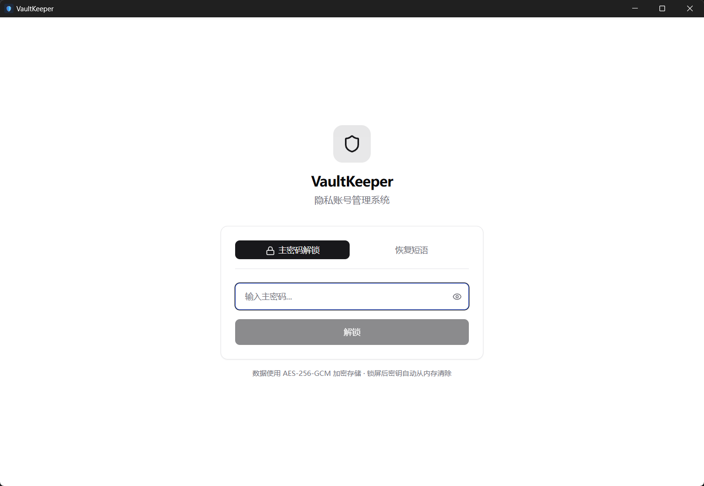
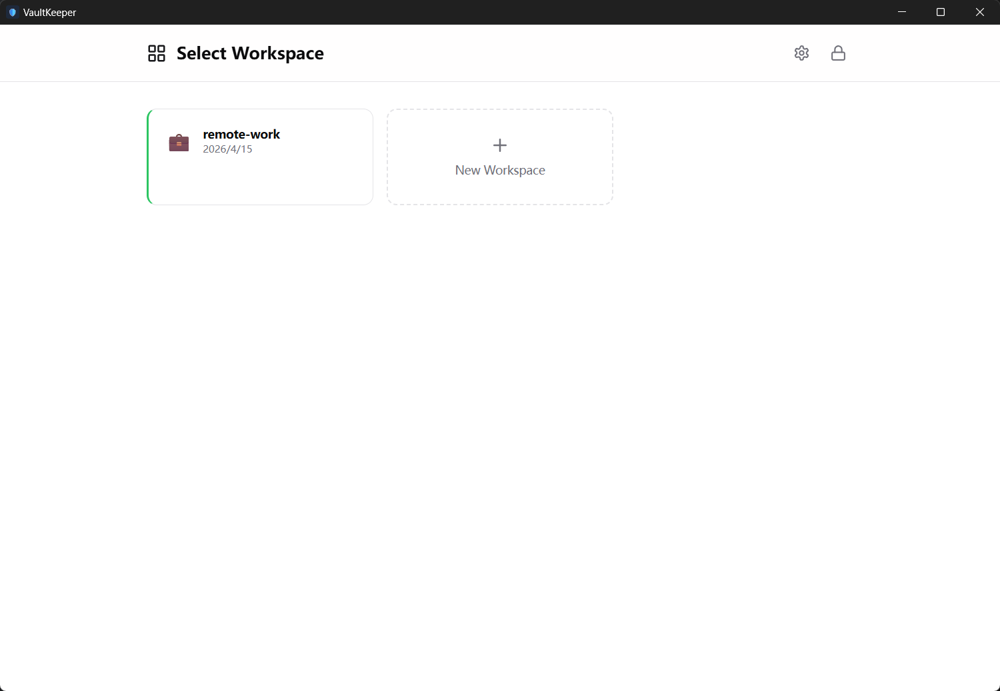
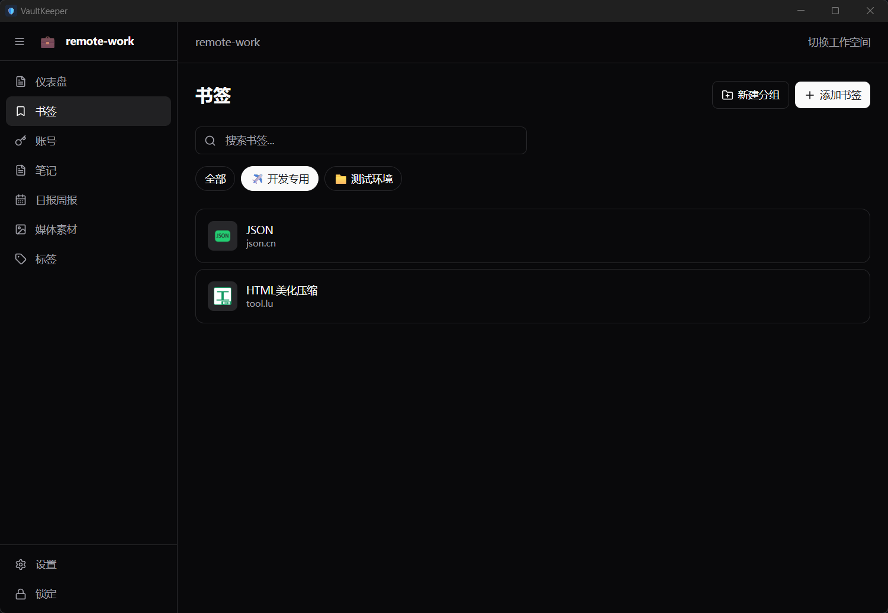
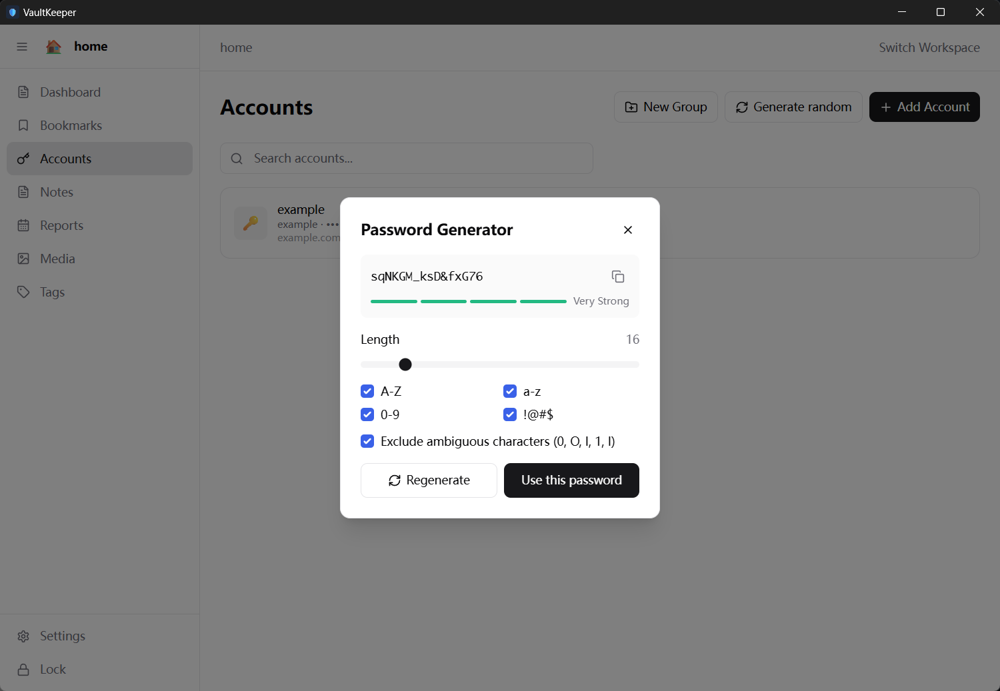
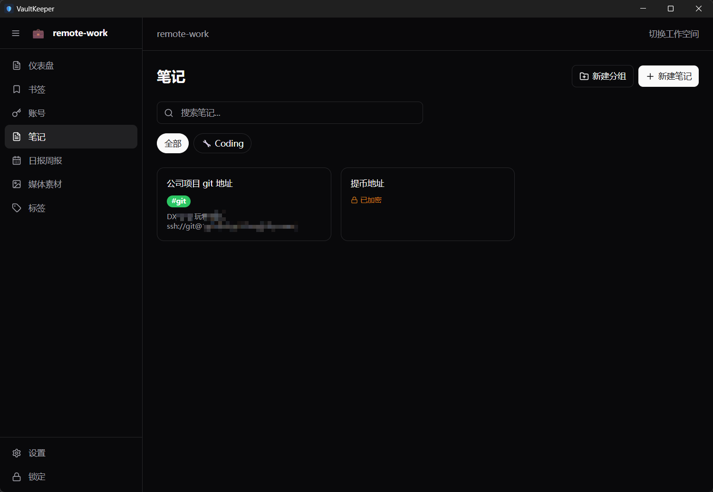
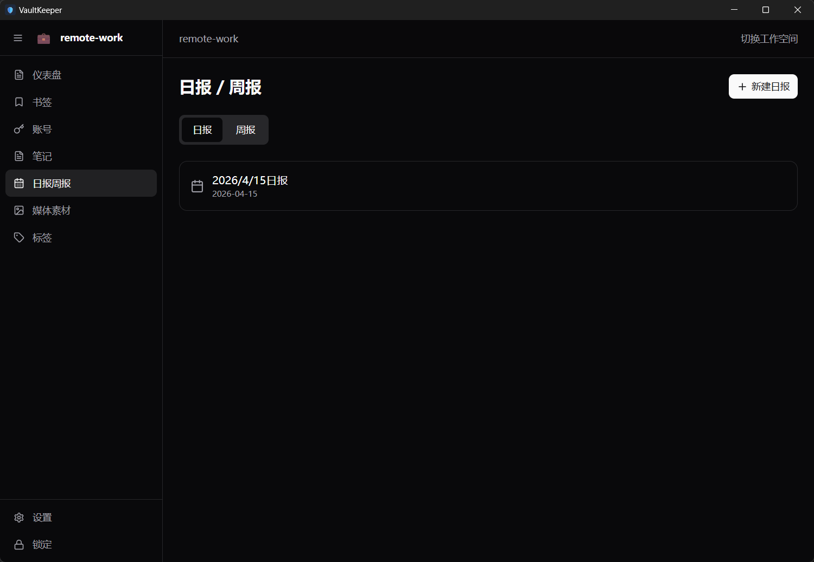
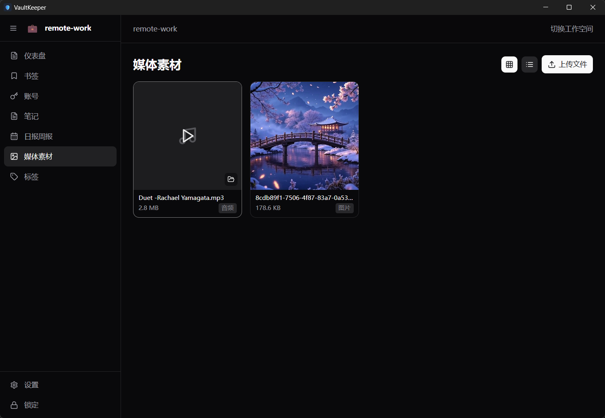

vault-keeper
------------

A privacy-focused, offline-first personal vault application for managing accounts, bookmarks, notes, and media — all encrypted locally on your device.

[Source Code](https://github.com/vault-keeper/desktop-app) | [Why vault-keeper?](https://github.com/AI-Star-Dev/vaultkeeper-releases/issues/1)

## Features

- **Account Management** — store and organize credentials with encrypted fields
- **Bookmarks** — save and categorize web links with notes
- **Notes** — write and organize markdown notes
- **Media** — manage and reference local media files
- **Reports** — generate summaries across your vault data
- **Tags** — tag and filter content across all categories
- **Workspace** — multi-workspace support with isolated storage
- **Lock Screen** — master-password protection with Argon2 hashing and AES-GCM encryption
- **Recovery** — BIP39 mnemonic phrase for workspace recovery

## Screenshots

